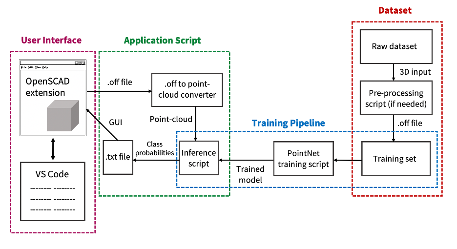

# AccessibleCAD

Software/Tools Required:
* OpenSCAD: https://openscad.org/
* VS-Studio: https://code.visualstudio.com/
    - Visual Studio OpenSCAD Extension: https://marketplace.visualstudio.com/items?itemName=Antyos.openscad
* Code from this Git repo
* Python
* Amazon AWS Virtual Machine: https://us-east-1.console.aws.amazon.com/
* Google Drive (for storing large data files): https://drive.google.com/drive/u/0/folders/1KWI5aRVr6sju8_ugDs9BFzA4C1gfiTkU

===============================================================================================

Project Components:

1. Code: 3 components
    a. Data preprocessing scripts: (for preparing training data for Point-Net). Would take training data hosted outside of repo, make modifications, and export in location outside of repo, while git-ignoring the data. Recommendation to start working with a small data subset to develop workflow.
    b. Point-Net scripts:
        i. Script for training the model based on training set
        ii. Script for testing the outputs on a dev set containing OpenSCAD point clouds.
        iii. Script for classifying individual images
    c. VS-Code extension: code incorporating user workflow into VS-Code, where users can make a model, output a .stl file, convert to point cloud, apply classification script, and provide class probabilities
2. Drive (or other cloud source): for storing large files, such as training and development datasets, models, etc.
3. AWS virtual machine: will be used for high-computation tasks. Developers can ssh in, pull the latest updates from the repo, and run scripts.

===============================================================================================

Installation and Set-Up:
1. Clone repo: https://github.com/danielfan17/AccessibleCAD.git (recommend using virtual environment to run the code, either venv or conda)
    b. Instructions for conda: https://sudhanva.me/install-tensorflow-on-apple-m1-pro-max/
2. Install required packages for PointNet, by one of the following:
    a. Type "pip3 install -r requirements.txt"
    b. Manually install glob, trimesh, numpy, tensorflow, matplotlib, h5py, pyglet
3. Test by running PointNet Reference locally with "python3 Reference.py"
    a. Documentation for code: https://keras.io/examples/vision/pointnet/

Training: 
1. Download data from Gdrive and place into “PointNet/data” folder
2. Open Training.py and modify "##### ADJUST BEFORE RUNNING #####” with relevant parameters before running
    - The training script takes the learning rate and epoch hyperparameters as argparse inputs, which can be inputted with -lr and -ep, respectively
3. Run with "python3 Training.py"
3. Trained model weights are in the “model” folder
4. Recommend using AWS for training with larger datasets, such as ModelNet40; recommend using tmux to keep training session alive indefinitely

Inference:
1. Open “Inference.py” and modify "##### ADJUST BEFORE RUNNING #####” with relevant parameters before running
    - “CADPATH” is the path to the CAD file to run inference on:
    - Can also use “python3 Inference.py “path_to_file/filename” to run inference on file directly from command line

Editing Model:
1. The model is now defined as a class in PointNetModel.py
2. If you make a change in the __init__, be sure to update accordingly in the “call” function (just follow the pattern)
3. Adjust batch size and learning rate in “Inference.py”
4. Adjust regularization factor in line 310 in “PointNetMode.py”

===============================================================================================

References/Documentation:
* PointNet: https://keras.io/examples/vision/pointnet/
* RS-CNN: https://yochengliu.github.io/Relation-Shape-CNN/
* OpenSCAD: https://openscad.org/documentation.html
* Saving Keras models (under saving subclass models): https://colab.research.google.com/drive/172D4jishSgE3N7AO6U2OKAA_0wNnrMOq#scrollTo=mJqOn0snzCRy
* Subclass Keras models: https://pyimagesearch.com/2019/10/28/3-ways-to-create-a-keras-model-with-tensorflow-2-0-sequential-functional-and-model-subclassing/
* Tmux: https://www.hamvocke.com/blog/a-quick-and-easy-guide-to-tmux/